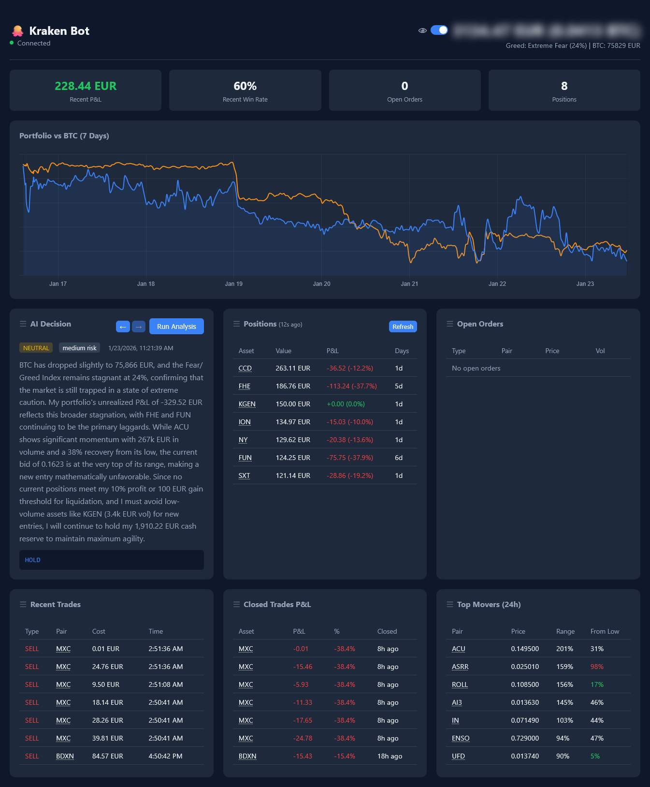

# Kraken Trading Bot

An AI-powered cryptocurrency trading bot for [Kraken](https://www.kraken.com) exchange.



## Disclaimer

**I AM NOT RESPONSIBLE FOR ANY LOSS OF FUNDS OR ANY OTHER DAMAGES FOLLOWING USE OF THIS SOFTWARE. USE AT YOUR OWN RISK. NEVER INVEST FUNDS THAT YOU CANNOT MISS.**

## Features

- **AI-Powered Trading** - Uses LLM models (default: Grok) to autonomously analyze your portfolio and execute trades
- **Real-time Dashboard** - Monitor positions, orders, P&L, and AI decisions from your browser
- **Position Tracking** - Tracks cost basis, unrealized P&L, and holding duration
- **Performance Analytics** - Win rate, realized P&L, and portfolio vs BTC comparison
- **Market Sentiment** - Incorporates Fear & Greed index into trading decisions

## Requirements

- Node.js 18+
- Kraken account with API key (trading permissions enabled)
- EUR balance in your Kraken account
- OpenRouter API key

## Quick Start

1. Clone and install:
   ```bash
   git clone https://github.com/yonie/kraken-bot.git
   cd kraken-bot
   npm install
   ```

2. Configure environment:
   ```bash
   cp .env.example .env
   ```
   
   Edit `.env` with your credentials:
   ```env
   KRAKEN_KEY=your-kraken-api-key
   KRAKEN_PASSCODE=your-kraken-secret
   OPENROUTER_API_KEY=sk-or-v1-your-key
   ```

3. Start the bot:
   ```bash
   npm start
   ```

4. Open the dashboard at `http://localhost:8000`

## Configuration

| Variable | Default | Description |
|----------|---------|-------------|
| `KRAKEN_KEY` | required | Your Kraken API key |
| `KRAKEN_PASSCODE` | required | Your Kraken API secret |
| `OPENROUTER_API_KEY` | required | OpenRouter API key for AI |
| `LLM_MODEL` | `x-ai/grok-3-mini-beta` | LLM model to use |
| `PORT` | `8000` | Dashboard port |
| `AI_ENABLED` | `true` | Enable/disable AI trading |
| `ANALYSIS_INTERVAL_MINUTES` | `30` | How often AI analyzes |

## Known Issues

- Only EUR trading pairs are supported (no USD)
- If you get "invalid nonce" errors, increase the API key nonce window to 10000ms in Kraken settings
- Disable automatic staking in Kraken to avoid issues with staked asset names

## License

GPL-3.0

## Donations

Found this useful? Donations welcome:

- [Buy Me a Coffee](https://buymeacoffee.com/yonie)
- ETH: `0xf923fe5103D9FA645161c244024e9f8c7Ed67E29`
- Solana: `9eFx8BNJGNN1PLkWxAxX3kLHVSLnnApFZfdcNMr3TjcR`
