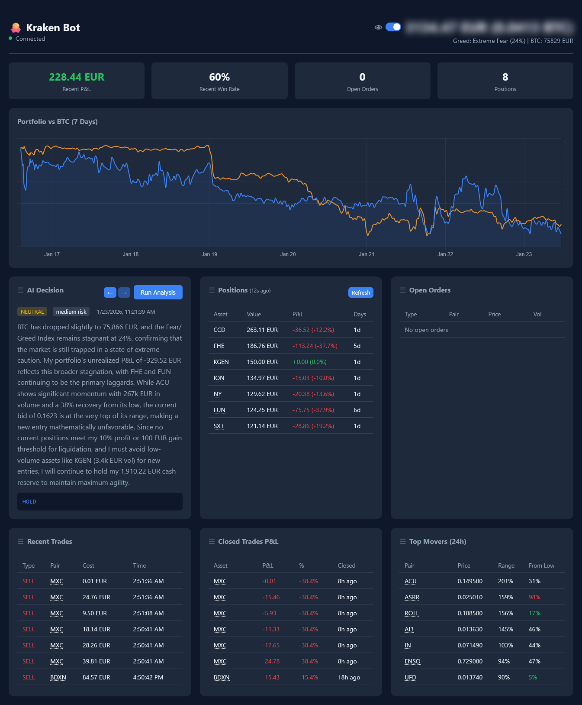

# Kraken Trading Bot

An AI-powered cryptocurrency trading bot for [Kraken](https://www.kraken.com) exchange.



## Disclaimer

**I AM NOT RESPONSIBLE FOR ANY LOSS OF FUNDS OR ANY OTHER DAMAGES FOLLOWING USE OF THIS SOFTWARE. USE AT YOUR OWN RISK. NEVER INVEST FUNDS THAT YOU CANNOT MISS.**

## Features

- **AI-Powered Trading** - Uses LLM models (default: Grok) to autonomously analyze your portfolio and execute trades
- **Real-time Dashboard** - Monitor positions, orders, P&L, and AI decisions from your browser
- **Position Tracking** - Tracks cost basis, unrealized P&L, and holding duration
- **Performance Analytics** - Win rate, realized P&L, and portfolio vs BTC comparison
- **Market Sentiment** - Incorporates Fear & Greed index into trading decisions
- **LLM Feedback Loop** - AI can request additional data it needs, stored for future development

## Requirements

- Node.js 18+
- Kraken account with API key (trading permissions enabled)
- EUR balance in your Kraken account
- One of: OpenRouter API key, OpenCode Zen API key, or local Ollama instance

## Quick Start

1. Clone and install:
   ```bash
   git clone https://github.com/yonie/kraken-bot.git
   cd kraken-bot
   npm install
   ```

2. Configure environment:
   ```bash
   cp .env.example .env
   ```
   
   Edit `.env` with your credentials:
   ```env
   KRAKEN_KEY=your-kraken-api-key
   KRAKEN_PASSCODE=your-kraken-secret
   LLM_PROVIDER=opencode           # ollama | openrouter | opencode
   OPENCODE_API_KEY=oc-your-key    # or OPENROUTER_API_KEY for openrouter
   LLM_MODEL=big-pickle            # opencode model id (free during preview)
   ```

3. Start the bot:
   ```bash
   npm start
   ```

4. Open the dashboard at `http://localhost:8000`

## Configuration

| Variable | Default | Description |
|----------|---------|-------------|
| `KRAKEN_KEY` | required | Your Kraken API key |
| `KRAKEN_PASSCODE` | required | Your Kraken API secret |
| `LLM_PROVIDER` | `ollama` | LLM provider: `ollama`, `openrouter`, or `opencode` |
| `OPENROUTER_API_KEY` | - | OpenRouter API key (when provider=openrouter; optional if `LLM_BASE_URL` points at a custom endpoint) |
| `OPENCODE_API_KEY` | - | OpenCode Zen API key (when provider=opencode) |
| `LLM_BASE_URL` | `https://openrouter.ai/api/v1` | Base URL for the OpenAI-compatible provider. Point it at any OpenAI-compatible endpoint (local shim, LiteLLM, gateway). `/chat/completions` is appended |
| `LLM_MODEL` | `qwen3.5:cloud` | LLM model — prefix `opencode/` for Zen, `opencode-go/` for Go |
| `PORT` | `8000` | Dashboard port |
| `AI_ENABLED` | `true` | Enable/disable AI trading |
| `ANALYSIS_INTERVAL_MINUTES` | `30` | How often AI analyzes |

### Pointing at a custom OpenAI-compatible endpoint

`LLM_BASE_URL` lets the `openrouter` provider talk to any OpenAI-compatible `/chat/completions` server, not just OpenRouter. This is handy if you want to run the bot against a local gateway/shim — for example one that fronts a coding-CLI subscription (`claude -p`, `codex exec`, `opencode run`) or a self-hosted model:

```env
LLM_PROVIDER=openrouter
LLM_BASE_URL=http://localhost:4000/v1   # your local OpenAI-compatible shim
LLM_MODEL=whatever-model-the-shim-exposes
# OPENROUTER_API_KEY is optional when the endpoint isn't openrouter.ai
```

The bot keeps speaking plain chat-completions; how that endpoint reaches a model (and how it authenticates) is entirely up to the shim.

> **Privacy Note:** This bot sends your full portfolio, balances, and trade history to the configured LLM provider. OpenCode Zen's free/preview models are logged and may be used for service improvement per their terms. Use a paid model or a local Ollama instance if you don't want your financial data retained.

## Project Structure

```
src/
├── index.js           # Entry point
├── state.js           # State management & persistence
├── news.js            # News fetching
├── server.js          # HTTP/WebSocket server
├── ai/                # AI/LLM module
│   ├── index.js       # Re-exports
│   ├── llm.js         # LLM provider calls
│   ├── commands.js    # Command parsing & execution
│   ├── context.js     # Context building for prompts
│   └── analysis.js    # Analysis loop, insights, questions
├── kraken/            # Kraken API module
│   ├── index.js       # Re-exports
│   ├── api.js         # Client & rate limiting
│   ├── pairs.js       # Asset pair utilities
│   ├── market.js      # Ticker, OHLC, depth, greed index
│   ├── balance.js     # Balance, ledgers, positions
│   ├── history.js     # Trade history
│   └── orders.js      # Order placement
└── server.js          # HTTP/WebSocket server
```

## Data Files

The bot stores data in `data/`:
- `insights.json` - AI-learned trading patterns
- `questions.json` - AI data requests for future development
- `llm_history.json` - Past AI decisions
- `balance_history.json` - Portfolio value over time
- `cost_basis.json` - Tax lot tracking

## API Endpoints

| Endpoint | Description |
|----------|-------------|
| `GET /api/state` | Full bot state |
| `GET /api/insights` | Stored insights |
| `GET /api/questions` | AI data requests |
| `POST /api/analyze` | Trigger AI analysis |
| `POST /api/refresh` | Refresh market data |

## Known Issues

- Only EUR trading pairs are supported (no USD)
- If you get "invalid nonce" errors, increase the API key nonce window to 10000ms in Kraken settings
- Disable automatic staking in Kraken to avoid issues with staked asset names

## License

GPL-3.0

## Donations

Found this useful? Donations welcome:

- [Buy Me a Coffee](https://buymeacoffee.com/yonie)
- ETH: `0xf923fe5103D9FA645161c244024e9f8c7Ed67E29`
- Solana: `9eFx8BNJGNN1PLkWxAxX3kLHVSLnnApFZfdcNMr3TjcR`
